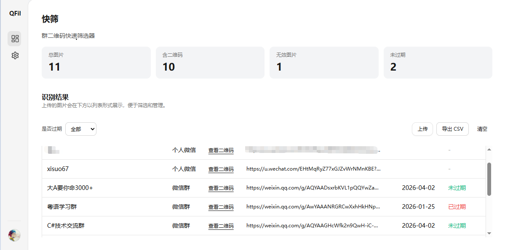
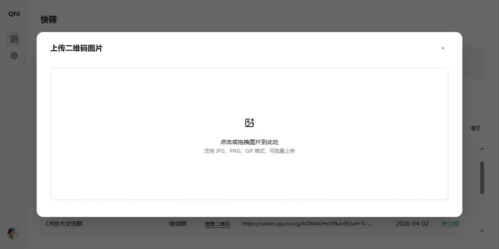
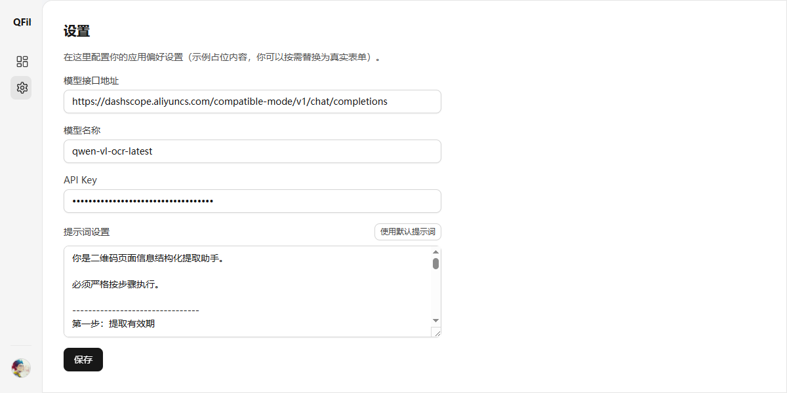
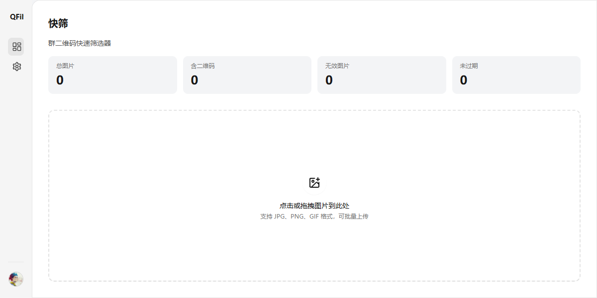
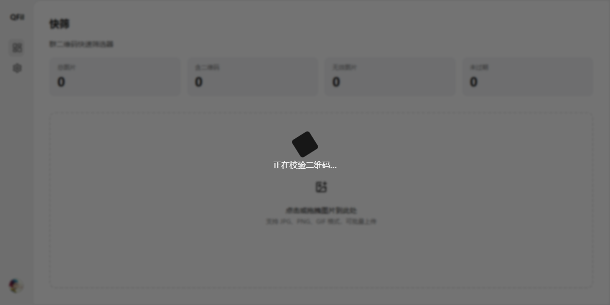

# QFilter（群二维码快速筛选）
QFilter 是一个桌面端工具，用于**批量上传群聊二维码截图**，并在收集过程中快速完成「是否有效 / 是否过期」的筛选与归档。

<table>
    <tr>
        <td></td>
        <td></td>
    </tr>
        <tr>
         <td></td>
        <td></td>
    </tr>
        </tr>
        <tr>
         <td></td>
        <td></td>
    </tr>
</table>

## 业务场景与痛点

在实际运营/增长/社群管理中，群二维码通常通过多人协作收集：

- **有效期很短**：很多二维码只有 7 天甚至更短的有效窗口，过期后无法进群，影响投放与转化。
- **来源分散**：截图来自不同渠道、不同人，命名不统一，重复与无效内容混杂。
- **人工筛选困难**：需要逐个打开、扫码、核对有效期，耗时且容易漏掉临期二维码。

QFilter 的目标是把这些步骤合并成一个可视化流程：上传 → 校验链接白名单 → 云端存储 → OCR 识别有效期 → 列表筛选/导出。

## 功能概览

- **本地校验**：解析二维码内容并校验域名白名单（不符合的标记为无效）。
- **云端上传**：将截图上传到对象存储（当前示例为七牛上传凭证 + 上传）。
- **OCR 识别**：调用 OCR 服务识别有效期/名称等信息，自动计算是否过期并写入表格。
- **筛选/导出**：支持按“是否过期”筛选，并导出 CSV。

## OCR 说明（仅支持阿里云百炼 Qwen OCR）

本项目 OCR **仅支持阿里云百炼（Model Studio / DashScope）** 的 Qwen OCR 模型（例如 `qwen-vl-ocr-latest`）。

官方文档见：[文字识别模型 qwen-vl-ocr 如何使用](https://help.aliyun.com/zh/model-studio/qwen-vl-ocr)

### 申请与开通

1. 登录阿里云百炼控制台，在视觉模型中找到 Qwen OCR 模型。
2. 创建/获取对应地域的 **API Key**（不同地域 Key 不同）。
3. 选择接入点（北京/新加坡/美国等），确保你的 `api_url` 与 Key 匹配（参考官方文档）。

### 在本项目中如何配置

打开应用的「设置」页面，填写并保存：

- **模型接口地址**：填写百炼 OpenAI 兼容接口地址（例如文档中的 `.../compatible-mode/v1/chat/completions`）
- **模型名称**：`qwen-vl-ocr-latest`（或你指定的版本）
- **API Key**：你的百炼 API Key
- **提示词**：你希望模型输出的 JSON 结构（项目会按 JSON 解析 `name` / `expire` 等字段）

保存后，回到「快筛」页面上传二维码截图即可触发识别。
